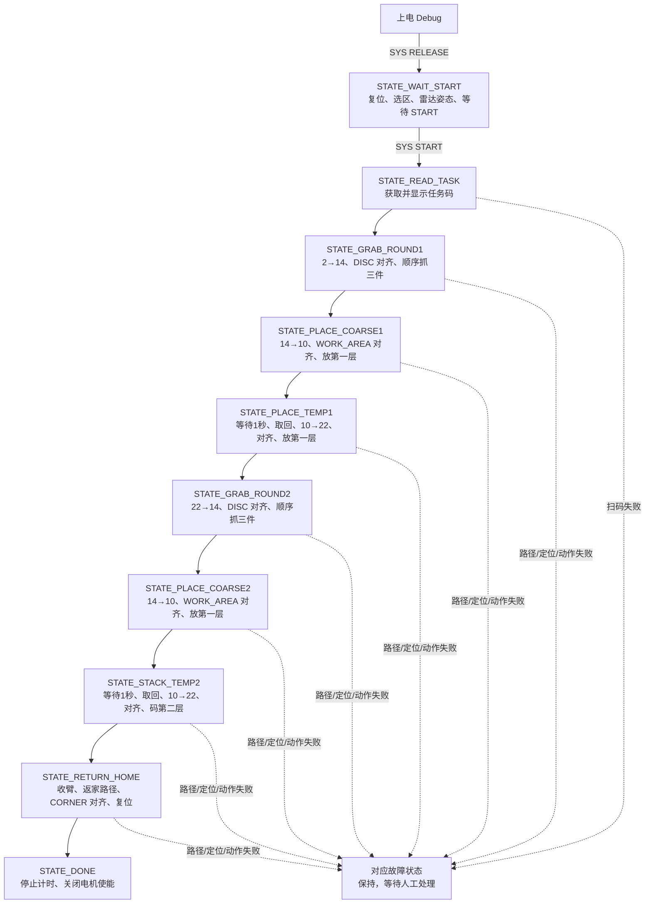

# 小车运行流程（按当前状态机实现）

本文依据当前 `src/main.cpp` 的 `Task_MainStateMachine()`、`src/robot_runtime.cpp` 的视觉任务/路径接口/总超时回调，以及 `src/serial_commands.inc`、`src/chassis.cpp`、`src/material_transfer.cpp` 的实际调用行为编写。核对日期：2026-10-07。注释掉的代码不计入运行流程；参数页的 RAM 修改可能改变死区、速度和位姿，本文列出的默认值以当前源码为准。

**当前两轮粗加工放料后均不再开启带物料定位：停车 → 等待 1000 ms → 按原任务位置直接取回三件。** 粗加工放料后的 `InitArm_look()`、`WORK_AREA_LOADED` 启停及对齐等待保留在源码注释中。粗加工放料前、暂存区第一层放料前使用 `WORK_AREA`；暂存区第二层码垛前已有第一层物料，使用 `WORK_AREA_LOADED`。

动作函数返回成功表示软件动作序列及物料记录更新完成；`ROUTE_DONE,ESTIMATED` 表示路径指令和估算等待完成。它们不等于传感器确认实际夹持、放置、车辆到位或物理归位。

## 1. 全局流程与状态分工

`STATE_PLACE_TEMP1` 和 `STATE_STACK_TEMP2` 的前半段仍在粗加工区：先取回物料，成功后才导航到暂存区。不能仅按状态名称判断车辆所在区域。

正常主循环每轮结束等待约 50 ms；等待视觉达标时仅退出本轮 switch，后续循环继续检查。导航、机械臂动作及明确的延时会阻塞调用任务。阶段标志在主状态机创建时初始化一次，成功后置位，避免每轮循环重复导航、取回或恢复观察姿态。

### 1.1 节点与朝向

| 用途 | 路径 | 终点车头朝向 | 开启的定位视觉 |
| --- | --- | --- | --- |
| 首轮圆盘 | 2 → 14 | 90° | DISC |
| 两轮粗加工 | 14 → 10 | 270° | WORK_AREA |
| 暂存第一层 | 10 → 22 | 180° | WORK_AREA |
| 暂存第二层 | 10 → 22 | 180° | WORK_AREA_LOADED |
| 第二轮圆盘 | 22 → 14 | 90° | DISC |
| 区1返家 | 22 → 4 | 180° | CORNER |
| 区2返家 | 22 → 0 | 180° | CORNER |

上述是请求的起终点；中间节点由外部路径规划端回传。首轮导航仍按扫码区节点2作为起点；扫码时的提前停车或手动任务码不会自动重新确定地图节点。

### 1.2 任务码与物料对应

格式为 `第一轮颜色+第一轮位置+第二轮颜色+第二轮位置`，共15字符。颜色每位允许1～6；每组位置必须是1、2、3的排列。颜色组的校验不要求三个颜色互不相同。

以日志中的 `412+312+124+231` 为例：

| 轮次 | 抓取顺序 / 载物台 | 粗加工放料位置 | 粗加工取回 | 暂存放料 |
| --- | --- | --- | --- | --- |
| 第一轮 | 颜色4→台1；颜色1→台2；颜色2→台3 | 台1→工位3；台2→工位1；台3→工位2 | 工位3→台1；工位1→台2；工位2→台3 | 同位置码312，第一层 |
| 第二轮 | 颜色1→台1；颜色2→台2；颜色4→台3 | 台1→工位2；台2→工位3；台3→工位1 | 工位2→台1；工位3→台2；工位1→台3 | 同位置码231，第二层 |

取回颜色直接沿用任务码，当前位置直接沿用该轮位置码；当前粗加工取回不重新进行视觉颜色/位置确认。粗加工与暂存使用同一套 `materialTransferLayout.workArea` 位姿。

## 2. 上电、Release 与启停区准备

### 2.1 setup：默认进入 Debug

1. 初始化 GPIO5 PWM、115200串口、舵机、电机、扫码模块和WS2812。GPIO5默认关闭，PWM默认2000 Hz。
2. 电机初始化时广播当前位置清零，包含5号升降和6号伸缩；清除堵转和清零命令之间留10 ms，清零后等待UART发送完成及10 ms间隔。将底盘理想位姿和机械臂维护值初始化；升降/伸缩从开机位置建立0 mm绝对目标坐标，延时100 ms后读取2号转台及1号夹爪舵机角度。
3. 初始化当前启用的OTA服务，创建视觉命令队列、雷达姿态互斥锁、单帧对齐反馈队列和运动互斥锁。
4. 对齐队列/锁创建成功才创建 `Task_VisualAlignment`；失败会打印 `[Align] ERR: failed to create alignment queue or mutex`。
5. 延时3000 ms，打印 `Debug mode`，状态灯变黄，默认开启手动连续视觉闭环，再创建串口控制任务。

自动主状态机在收到 RELEASE 或 Debug空闲时按下BOOT0后创建。BOOT0为GPIO0低电平按键，40 ms消抖，稳定松开后才允许再次触发；上电按住不触发。串口动作执行或半帧接收期间按下不排队，Release中按下不重复切换。按键复用串口RELEASE入口，成功同样回复 `{RSP,SYS,RELEASE,OK}`，仍等待选区及SYS START。上电时并未由 setup 自动调用机械臂复位；自动复位发生在下面的 WAIT_START 阶段。

升降/伸缩的所有 `MoveArm` 调用改为 EMM V5 绝对位置控制：直接发送目标毫米数换算出的脉冲，不再按 `currentArm` 的差值移动；重复目标和0目标也发令，`-1`仍跳过该轴。开机清零把当时位置定义为零，不执行机械寻零；应在已知起始姿态开机。目前不校验清零应答，也不读取两轴位置确认到位，维护值仍为下发目标。

### 2.2 SYS RELEASE：建立自动任务

发送 `{CMD,SYS,RELEASE}`：

1. 若物料识别处于活动状态，先请求停止；关闭视觉底盘闭环并停车。
2. 创建一次性总任务定时器，周期 `3000000 ms = 3000 s = 50 min`。此时只创建，尚未开始计时。
3. 设置 `STATE_WAIT_START`，清除动作中止标志，关闭抓取准备状态，令 `enableRun=false`。
4. 创建主状态机任务。定时器/任务创建失败回复 `ERR,TIMER` / `ERR,TASK`，不进入正常Release流程。
5. 成功切换Release，状态灯变绿，打印 `Release mode` 并回复 `{RSP,SYS,RELEASE,OK}`。Release中再次发送RELEASE会被拒绝为MODE。

### 2.3 STATE_WAIT_START：选区、雷达姿态与启动

主任务先延时约1秒，再按顺序执行：

1. 打印 `TASK start`，调用 `InitArm_start()`，显示 `WAIT start_zone`。
2. 每100 ms检查启停区，直到收到有效 `{CMD,NAV,START_ZONE,1}` 或 `...,2`。
3. 保存 `homeStartZone=currentStartZone`，供正常返家使用；运行中修改START_ZONE不会改变已经保存的返家区。
4. 设置开局理想位姿：区1为 `(2250,150,180°)`，区2为 `(150,150,180°)`，并显示 `start_zone: 1/2`。两个区车头均朝左；区2向右扫码时后退，航向不变。Debug选区和上位机初始显示采用同样的朝向。
5. 调用 `runLidarPoseAction()`，自动执行一次对应区域的雷达扫描姿态。
6. 显示 `WAIT START`，每100 ms检查 `enableRun`。机载电脑完成外部扫描后发送 `{CMD,SYS,START}`，主控回复 `{RSP,SYS,START,OK}` 并设置启动标志。
7. 主循环观察到启动标志后启动总任务定时器，转入 `STATE_READ_TASK`。

`SYS READY`只记录 `nano_ready=true` 并回复OK；当前WAIT_START分支没有把READY作为启动门槛，也不直接消费雷达扫描结果。START表示外部允许继续，不代表主控验证了雷达结果。代码按启动标志检查，不保证START一定在WAIT START提示之后才发送。

雷达姿态的区域差异如下，数值按现有 `GotoPose` / `MoveArm` 参数记载：

| 区域 | 执行顺序 |
| --- | --- |
| 区1 | `GotoPose(125,0,0,true)` → `MoveArm(150,100,-1,-1,200)` → 等2秒 → `GotoPose(0,100,0,true)` → 转台45°、伸出100 → 等1秒 → 升降降到0、伸出100 |
| 区2 | `GotoPose(125,0,0,true)` → `MoveArm(150,100,-1,-1,200)` → 等2秒 → `GotoPose(0,-100,0,true)` → 升降0、伸出100、转台135° |

`runLidarPoseAction()`用互斥锁防止自动流程和手动按钮并发执行。自动入口遇忙报告 `LIDAR_POSE_FAILED,BUSY`；手动入口遇忙回复ERR,BUSY。已有动作结束后仍可能报告 `LIDAR_POSE_DONE`。

**现有实现边界：** WAIT_START和READ_TASK调用的 `InitArm_start()` 未检查返回值；WAIT_START也不根据 `runLidarPoseAction()` 返回值进入故障。`PrepareLidarScanPose()` 内部未逐项检查 `GotoPose/MoveArm` 返回结果。应按当前代码理解这些阶段，不能把DONE或流程继续解释为全部物理动作已验证成功。

## 3. STATE_READ_TASK：扫码与任务码获取

1. 显示 `READ TASK`，再次调用 `InitArm_start()`。
2. 若已通过 `TASK SET`提交有效任务码，直接跳过全部扫码接近和扫描移动。
3. 未收到任务码时，固定本次扫码区号并检查有效性。启停区1向左接近，调用 `MovePosition(0,+900,0,60)`；启停区2向右接近，调用 `MovePosition(0,-900,0,60)`。这里的正负值为位置接口的车身Y位移。这次接近移动没有传入扫码提前停止回调。
4. 接近成功后开始400 mm扫描区往返，扫描速度为30 RPM。启停区1首次扫描使用+Y，启停区2首次扫描使用-Y，后续交替反向。每段前先检查任务码；调用扫描位置移动时传入 `pollTaskCode`，动作等待期间会轮询扫码/手动码，收到有效码可提前停止当前扫描段。

| 扫描次数 | 日志编号 | 位移（车身Y） | 完整走完时相对接近前起点的位置 |
| --- | --- | --- | --- |
| 初次扫描 | scan 0/3 | +400 mm | 1300 mm |
| 重试1 | scan 1/3 | -400 mm | 900 mm |
| 重试2 | scan 2/3 | +400 mm | 1300 mm |
| 重试3 | scan 3/3 | -400 mm | 900 mm |

表中位移和累计距离均沿各区接近扫码点的方向计正；启停区2传给位置接口的Y位移与表中符号相反。

5. `pollTaskCode`读取扫码器字符串，打印 `[SCANNER] recv: ...` 并校验15字符格式。有效码提交 `currentTask` 并设置 `taskReceived=true`；已提交的手动码不会被迟到扫码结果覆盖。
6. 四次扫描耗尽、位置移动失败或区号无效，且仍无任务码时：显示 `TASK ERR`，停止总定时器，进入 `STATE_SCAN_FAILED`。
7. 成功时重新组装任务码，发送 `{EVT,DISPLAY,TASK_CODE,任务码}`，显示 `TASK OK`，清空旧视觉命令队列，进入 `STATE_GRAB_ROUND1`。

手动替代扫码使用 `{CMD,TASK,SET,412+312+124+231}`。Debug允许设置；Release仅WAIT_START或READ_TASK尚未收到码时允许设置，其他阶段回复BUSY。设置任务码重置进度，不清空载物台占用，也不改变车辆位置；尤其预置码跳过扫码移动后，仍需现场保证首轮路径起点符合节点2的假定。

## 4. 第一轮：圆盘抓取 → 粗加工 → 暂存第一层

### 4.1 STATE_GRAB_ROUND1：导航与圆盘定位

1. 显示 `GRAB R1`。首次请求路径 `2→14`；路径成功后置 `discRouteCompleted=true`，清零 `roundProgress`，关闭抓取准备标志。
2. 调用 **`InitArm_look3()`**，成功后请求 `START_REQUEST,DISC`。look3失败显示 `DISC ARM ERR`，停止总定时器，进入搬运故障。
3. `requestVisionStart(DISC)`先清空旧反馈并开启自动连续闭环，再发送视觉启动事件。机载电脑持续回传 `{CMD,VISION,ALIGN_DATA,angle,x,y}`。
4. 对齐处于WAITING时留在本状态轮询。对齐结束时先保存结果，再关闭底盘PID并请求 `STOP_REQUEST,DISC`。
5. 只有DONE允许继续；FAILED或IDLE显示 `DISC ALIGN ERR`，停止计时并进入 `STATE_ALIGN_FAILED`。
6. DONE后清空视觉命令队列，依次等待100 ms和1000 ms。源码中的 `GotoPose(-45,0,0,true)` 已注释，这里不执行该位移。
7. 调用 `InitArm_look2()`，成功后设置 `firstDiscGrabReady=true`，请求 `START_REQUEST,DISC_MATERIAL`，置 `discMaterialRequested=true`，显示 `WAIT DISC MATERIAL`。

### 4.2 STATE_GRAB_ROUND1：三件颜色驱动抓取

1. 机载电脑发送 `{CMD,VISION,COLOR,color}`。主控按 `round1_colors[roundProgress]` 判定，目标载物台为 `roundProgress+1`。
2. 颜色不匹配时回复接收OK，报告 `COLOR,SKIP,color,cargo,COLOR_MISMATCH`，继续等待，不改变进度。
3. 匹配且状态允许、底盘对齐已停、载物台为空时，报告 `COLOR,GRAB,color,cargo`，串口任务执行 `GrabDiscMaterial(color,cargo)`。匹配但条件不允许时报告BLOCKED及原因。
4. 抓取开始前令 `firstDiscGrabReady=false`，清除恢复请求。相机继续识别，主控屏蔽颜色触发；此阶段COLOR仅回复OK并丢弃，不缓存下一件颜色。
5. `GrabDiscMaterial`完成圆盘抓取、抬升、放入指定载物台；成功后登记载物台颜色，报告 `GRAB,DONE`并推进进度。失败报告 `GRAB,FAILED`，保持进度，结束物料视觉，显示 `DISC GRAB ERR`并进入搬运故障，不自动重试。
6. 第1、2件成功后，主状态机打印 `[DISC] Restoring observation after grab N`，各执行一次 `InitArm_look2()`。成功后更新 `discPreparedProgress`，请求串口任务清理固定旧缓存及跨边界旧半帧。
7. 串口任务到达旧数据后的完整帧边界，再恢复抓取准备并打印 `[DISC] Color handling resumed: expected=..., cargo=...`。持续新帧不会让等待无限延长；恢复过程不反复启停相机。
8. 第3件成功时，串口任务先请求 `STOP_REQUEST,DISC_MATERIAL`，再发布 `roundProgress=3`。主状态机关闭准备标志、清零进度，进入 `STATE_PLACE_COARSE1`；不再执行第三次恢复观察。

抓取在串口任务内阻塞执行，长动作期间可能积压输入，返回后日志会集中出现COLOR应答。COLOR,OK表示接收；确认本次抓取结果应看GRAB,DONE/FAILED，而非OK数量。

### 4.3 STATE_PLACE_COARSE1：粗加工定位与放料

1. 显示 `GO COARSE1`，再次请求结束DISC_MATERIAL并清空旧视觉命令队列；重复停止事件可以出现。
2. 首次请求 `14→10`，终点朝向270°。成功置 `coarse1RouteCompleted=true`并清零进度。
3. 关闭对齐并停车，调用 `InitArm_look()`。该函数成功后还执行源码中的 `vTaskDelay(1000)`，其参数是1000个RTOS tick；确认状态未改变、动作未中止后，启动WORK_AREA，置 `coarse1VisionRequested=true`。
4. 等待WORK_AREA达到DONE；结束时先关闭PID并请求STOP_REQUEST,WORK_AREA，再判断保存的结果。FAILED/IDLE显示 `COARSE ALIGN ERR`并进入对齐故障。
5. 显示 `PLACE C1`，执行 `PlaceTaskCargoToWorkArea(currentTask.round1_pos,1)`：依载物台1、2、3顺序放到对应工位第一层。每件成功后清空该载物台记录。
6. 整组失败显示 `PLACE C1 ERR`并进入搬运故障；整组成功清零进度，确认任务未中止，进入 `STATE_PLACE_TEMP1`。放料后的观察姿态和WORK_AREA_LOADED请求已注释。

### 4.4 STATE_PLACE_TEMP1：等待、直接取回、暂存放料

本状态按三个子阶段执行，已成功的阶段不重复。

**A. 粗加工取回：**

1. `temp1CargoRetrieved=false`时关闭PID并停车，检查动作中止标志，显示 `WAIT RETRIEVE C1`。
2. 执行 `vTaskDelay(pdMS_TO_TICKS(1000))`，明确等待1秒；等待后再次检查仍处于STATE_PLACE_TEMP1且未中止。
3. 显示 `RETRIEVE C1`，直接调用 `RetrieveRoundToCargo(round1_colors,round1_pos)`：从位置码指定的工位逐件取回，按原任务顺序放回载物台1～3并登记颜色。
4. 不等待WORK_AREA_LOADED的ALIGN_DONE，不发送本阶段的带物料视觉启停事件。
5. 取回失败显示 `RETRIEVE C1 ERR`，停止总定时器并进入搬运故障；全部成功置 `temp1CargoRetrieved=true`、清零进度，再进入下一次主循环。

**B. 前往暂存区：**

1. 显示 `GO TEMP1`，请求 `10→22`，终点朝向180°。
2. 路径成功置 `temp1RouteCompleted=true`；关闭PID、执行 `InitArm_look()`，成功且未中止后请求WORK_AREA并置 `temp1VisionRequested=true`。
3. 路径失败进入路径故障；观察姿态失败显示 `WORK AREA ARM ERR`并进入搬运故障。

**C. 暂存第一层放料：**

1. 显示 `ALIGN TEMP1`并等待对齐DONE。停止PID和WORK_AREA后，非DONE显示 `TEMP ALIGN ERR`并进入对齐故障。
2. 显示 `PLACE T1`，调用 `PlaceTaskCargoToWorkArea(round1_pos,1)`，按第一轮位置码放到暂存第一层。
3. 失败显示 `PLACE T1 ERR`并进入搬运故障；全部成功清零进度，进入 `STATE_GRAB_ROUND2`。

## 5. 第二轮：圆盘抓取 → 粗加工 → 暂存第二层

### 5.1 STATE_GRAB_ROUND2

整体颜色处理、逐件放回载物台、屏蔽旧帧、成功推进进度和失败保持规则与第一轮相同，具体差异如下：

| 项目 | 第二轮实际行为 |
| --- | --- |
| 路径 | `22→14`，终点90°，由 `disc2RouteCompleted`保证只执行一次 |
| 圆盘定位前姿态 | **`InitArm_look2()`**，与首轮look3不同 |
| 定位 | 启动DISC，等待DONE，停车并结束DISC；失败进入对齐故障 |
| 识别前准备 | 等100 ms、再等1000 ms；执行look2；开启DISC_MATERIAL |
| 颜色数组 | `currentTask.round2_colors` |
| 抓取顺序 | 第i件颜色→载物台i+1，成功才推进进度 |
| 观察恢复 | 第1、2件成功后各执行look2，用 `disc2PreparedProgress`防止重复 |
| 识别/恢复标志 | `disc2MaterialRequested`及与首轮共用的抓取准备/清旧帧标志 |
| 三件完成 | 先结束DISC_MATERIAL，再由主状态机清零进度，转 `STATE_PLACE_COARSE2` |
| 主要提示 | `GRAB R2`、`WAIT DISC MATERIAL`、`DISC ALIGN ERR`、`DISC ARM ERR` |

### 5.2 STATE_PLACE_COARSE2

1. 显示 `GO COARSE2`，关闭DISC_MATERIAL并清空旧视觉命令队列。
2. 请求 `14→10`，终点270°；成功置 `coarse2RouteCompleted=true`。
3. 停车，执行 `InitArm_look()`；成功且未中止后直接开启WORK_AREA，置 `coarse2VisionRequested=true`。**第二轮此处没有首轮look之后的额外 `vTaskDelay(1000)`。**
4. 等待DONE，关闭PID并结束WORK_AREA。非DONE显示 `COARSE ALIGN ERR`并进入对齐故障。
5. 显示 `PLACE C2`，执行 `PlaceTaskCargoToWorkArea(round2_pos,1)`，粗加工仍放第一层。
6. 失败显示 `PLACE C2 ERR`并进入搬运故障；成功清零进度并检查中止，转 `STATE_STACK_TEMP2`。本轮放料后的look和WORK_AREA_LOADED同样已注释。

### 5.3 STATE_STACK_TEMP2

1. 首次先在粗加工区取回：停车，显示 `WAIT RETRIEVE C2`，等待1000 ms，再检查状态与中止标志。
2. 显示 `RETRIEVE C2`，直接执行 `RetrieveRoundToCargo(round2_colors,round2_pos)`。失败显示 `RETRIEVE C2 ERR`并进入搬运故障；成功置 `temp2CargoRetrieved=true`、清零进度。本阶段没有带物料定位。
3. 下一阶段显示 `GO TEMP2`，请求 `10→22`，终点180°。成功置 `temp2RouteCompleted=true`，停车并执行look，成功且未中止后开启WORK_AREA_LOADED，识别已放有第一层物料的工位。
4. 显示 `ALIGN TEMP2`并等待DONE；停车并结束WORK_AREA_LOADED后，非DONE显示 `TEMP ALIGN ERR`并进入对齐故障。
5. 显示 `STACK T2`，执行 `PlaceTaskCargoToWorkArea(round2_pos,2)`，按第二轮位置码放在暂存第二层。
6. 每个目标松手高度为对应工位基础高度加 `secondLayerOffset`。整组放料前检查载物台非空、位置码、位姿和三处目标高度，目标高度不能超过 `ARM_HEIGHT_LIMIT_MM=175 mm`。
7. 失败显示 `STACK T2 ERR`并进入搬运故障；全部成功清零进度，转 `STATE_RETURN_HOME`。

第一轮和第二轮暂存位置由各自位置码决定；第二轮不会改用第一轮位置码。部分搬运失败时已经成功更新的载物台记录保留，不自动重复整组动作。

## 6. 正常返家与完成

### 6.1 STATE_RETURN_HOME

1. 首次显示 `GO HOME`，校验开局保存的homeStartZone。区号无效显示 `HOME ZONE ERR`并进入路径故障。
2. 关闭抓取准备，请求结束DISC_MATERIAL，关闭视觉底盘PID并停车。
3. 执行 `InitArm_start()` 收臂；失败显示 `HOME ARM ERR`并进入搬运故障。
4. 按保存的区域请求返家路径：区1为 `22→4,180°`；区2为 `22→0,180°`，均恢复开局车头朝左的朝向。路径失败显示 `HOME ROUTE ERR`并进入路径故障。
5. 成功置 `homeRouteCompleted=true`，启动CORNER，置 `homeVisionRequested=true`。当前代码在启动CORNER前不额外调用look。
6. 显示 `ALIGN HOME`，机载电脑回传角点angle/x/y误差，等待DONE。结束时关闭PID并停止CORNER；FAILED/IDLE显示 `HOME ALIGN ERR`并进入对齐故障。
7. CORNER达标后再次执行 `InitArm_start()`，失败显示 `RESET ARM ERR`并进入搬运故障。
8. 复位成功且状态未变时，清零进度，停止总定时器，进入 `STATE_DONE`。

### 6.2 STATE_DONE

显示 `DONE`，再次停止总定时器，调用 `Emm_V5_En_Control_all(false)`关闭电机使能，执行很长的保持延时。DONE并不自动清空全部阶段标志或开始下一局，当前自动流程按一次任务编排。

源码没有在此发送完整统计报告或独立的任务完成统计帧；可观察的完成提示是 `{EVT,DISPLAY,DEBUG,DONE}`。

## 7. 跨阶段接口与等待条件

### 7.1 路径请求和执行

1. 状态机调用 `requestAndMoveNodePath(start,end,finalHeading)`，内部设置WAITING并发送 `{EVT,NAV,ROUTE_WAITING}`、`{EVT,NAV,ROUTE_REQUEST,start,end}`。
2. 外部端回传 `{CMD,NAV,ROUTE,n1,n2,...,nN}`。Release仅在等待路径时接收；回复 `{RSP,NAV,ROUTE,ACK,N}` 后才发布可执行状态。ACK表示路径接收，不表示移动完成。
3. 固件检查首尾节点与请求一致，否则发送 `ROUTE_FAILED,ENDPOINT`。有效路径再经过执行层检查、合并同向共线段、原地转向、前进/后退及估算等待。
4. 到达终点朝向并结束估算等待后发送 `{EVT,NAV,ROUTE_DONE,ESTIMATED}`，函数成功返回，才启动下一步观察姿态/视觉。

等待外部路径的循环每20 ms检查一次，没有单独的路径接收超时；启动后的3000秒总任务定时器仍有效。不能将“未回传路径时保持等待”误认为已有路径执行失败。

### 7.2 当前视觉启停顺序

| 阶段 | 启动前动作 | 视觉启动 | 继续条件 / 结束时机 |
| --- | --- | --- | --- |
| 首轮圆盘定位 | 路径完成、look3成功 | DISC | DONE后停车并停止DISC，随后准备物料识别 |
| 第二轮圆盘定位 | 路径完成、look2成功 | DISC | 同上 |
| 两轮圆盘抓取 | DISC已结束、look2成功 | DISC_MATERIAL | 第三件成功前持续识别；抓取失败或恢复look失败也停止 |
| 两轮粗加工放料前 | 路径完成、look成功 | WORK_AREA | DONE后**先停止视觉/PID，再放料** |
| 两轮粗加工放料后 | 停车等待1秒 | 不启动WORK_AREA_LOADED | 直接取回成功后才允许导航 |
| 暂存第一层放料前 | 路径完成、look成功 | WORK_AREA | DONE后**先停止视觉/PID，再放第一层** |
| 暂存第二层码垛前 | 路径完成、look成功 | WORK_AREA_LOADED | DONE后**先停止视觉/PID，再码第二层** |
| 正常返家 | 收臂、返家路径完成 | CORNER | DONE后先停车并停止CORNER，再复位 |

`START_REQUEST`和`STOP_REQUEST`是主控发给机载电脑的请求事件，不带区域号，也不等待相机启停ACK。机载电脑需结合流程阶段区分WORK_AREA来自粗加工还是暂存；相机停止可能略晚于事件，尾帧可能报告 `ALIGN_IGNORED,DISABLED`。

### 7.3 对齐达标、超时与连续闭环

定位模式启动时清旧帧，开始自动WAITING及15秒计时。机载电脑只需发送ALIGN_DATA，无需另发ALIGN_START。当前源码默认死区如下，X/Y是视觉单位，角度为度：

| 模式 | X死区 | Y死区 | 角度死区 | 自动流程用途 |
| --- | --- | --- | --- | --- |
| DISC | 8 | 8 | 0.5° | 两轮圆盘定位 |
| DISC_MATERIAL | 3 | 3 | 0.2° | 仅保留参数；物料识别请求不驱动底盘对齐 |
| WORK_AREA | 3 | 3 | 0.2° | 两轮粗加工、暂存第一层放料前定位 |
| WORK_AREA_LOADED | 3 | 3 | 0.2° | 暂存第二层码垛前带物料定位；手动接口保留 |
| CORNER | 6 | 6 | 0.4° | 正常返家角点定位 |

- 连续5个新有效反馈帧的三项偏差绝对值均不大于各自死区才达标，发ALIGN_DONE并将自动状态锁存为DONE。前1～4帧达标时已停车，但还不能开始业务动作。
- 越界、无效反馈、模式切换、启停会清连续计数；队列覆盖导致序号不连续，或处理帧间隔达到300 ms时也清计数。没有新帧不会增加计数。
- ALIGN_DONE后连续闭环仍保持开启；业务状态机读取DONE后主动停止，才进行抓放。
- 从启用自动对齐起15秒内未首次达标（包括没有首帧）则停车、关闭闭环，发 `{EVT,VISION,ALIGN_FAILED,TIMEOUT}`，主流程进入对齐故障。
- **当前300 ms断流停车/失败分支已注释。** 等待新反馈期间可能保持上次轮速；300 ms队列等待及恢复反馈后的计数重置仍保留，不能把它写成现行自动停车保护。
- 自动等待期间，同模式或无模式ALIGN_START回复OK且不重置模式、反馈、计数和15秒起点；不同模式或尚未处理的FAILED回复BUSY。ALIGN_STOP会取消等待，主流程将非DONE结果按失败处理。

### 7.4 物料记录和动作成功条件

`roundProgress`用于圆盘逐件顺序推进；其他阶段有独立的单次完成标志。粗加工取回不靠外部进度指令跳转。

| 操作 | 预检查 | 成功后的软件记录 |
| --- | --- | --- |
| 普通圆盘抓取 | 颜色/载物台编号、占用、放置位姿等 | 对应载物台登记本次颜色；自动进度增加1 |
| 三件放料/码垛 | 位置码、层数、位姿、三台均非空、目标高度等 | 每件放完后清空该载物台；全部成功才进入下一阶段 |
| 三件取回 | 颜色/位置码、位姿、三台均为空等 | 从各任务工位取回并登记到载物台1～3；全部成功才允许导航 |

取回沿用已有 `MoveWorkAreaToCargo`，抓放沿用 `pickAt/placeAt`。失败可能发生在部分动作已执行之后；代码保留已完成更新的记录，不自动整组重试，也没有物料传感器对每次抓放结果进行独立确认。

## 8. 故障与总任务超时

| 状态 | 典型触发 | 常见显示提示 | 后续行为 |
| --- | --- | --- | --- |
| STATE_SCAN_FAILED | 无有效任务码，接近/扫描失败或重试耗尽 | TASK ERR | 停止总计时器，保持故障 |
| STATE_ROUTE_FAILED | 路径端点/执行失败，返家区号无效 | ROUTE ERR、HOME ROUTE ERR、HOME ZONE ERR | 不启动下一阶段视觉或搬运，保持故障 |
| STATE_ALIGN_FAILED | 15秒未达标或等待被停止成为非DONE | DISC/COARSE/TEMP/HOME ALIGN ERR | 对应定位PID及视觉已停止，保持故障 |
| STATE_TRANSFER_FAILED | 观察/复位姿态、抓取、放料、取回失败 | DISC/WORK AREA ARM ERR、PLACE/RETRIEVE/STACK ERR、HOME/RESET ARM ERR | 停止计时，不继续导航/整组重试 |
| STATE_TIMEOUT_FAILED | 启动后的总任务3000秒耗尽 | TASK TIMEOUT | 全视觉结束、六电机急停、暂停主任务、等待人工处理 |

普通故障分支每100 ms保持等待，不会自动跳到下一状态；多数检测分支停止总任务计时器。故障状态本身只是保持循环，不能理解为统一执行了与总超时完全相同的六电机急停清理。

总超时回调名为 `vHomeTimerCallback`，但当前行为是**停机，不自动返家**：设置 `taskMotionAborted=true`，锁存超时故障，关闭抓取准备，停止五种视觉请求及底盘PID，将路径状态置FAILED，暂停主状态机，停止电机1～6，保留夹爪位置不主动松手。回调再锁存超时状态以防主任务退出动作时覆盖，发送 `ROUTE_FAILED,TIMEOUT`和人工处理提示。后续MoveArm发令受中止标志约束。

超时或部分搬运失败时位置和持料状态可能不确定；当前代码没有自动从故障续跑/重新建局的状态机流程，应现场处理后重新初始化任务。正常DONE会停止总定时器。

## 9. 日志核对顺序

按以下顺序确认阶段衔接；DISPLAY相同内容会去重，不会每次轮询都输出。

| 阶段 | 预期主要日志顺序 |
| --- | --- |
| 开局 | Release mode → TASK start → WAIT start_zone → start_zone → 雷达姿态结果 → WAIT START → READ TASK |
| 扫码 | SCANNER recv/task code OK → DISPLAY TASK_CODE → TASK OK |
| 圆盘 | GRAB R1/R2 → ROUTE_REQUEST → ROUTE_DONE,ESTIMATED → START_REQUEST,DISC → ALIGN_DONE → STOP_REQUEST,DISC → START_REQUEST,DISC_MATERIAL |
| 每件抓取 | COLOR,GRAB → Material placed → GRAB,DONE；前两件随后Restoring observation → Color handling resumed |
| 粗加工 | GO COARSE1/2 → 路径完成 → START_REQUEST,WORK_AREA → ALIGN_DONE → STOP_REQUEST,WORK_AREA → PLACE C1/C2 |
| 粗加工直接取回 | WAIT RETRIEVE C1/C2 → 至少等待1秒 → RETRIEVE C1/C2 → GO TEMP1/2；正常此段无ALIGN LOADED或LOADED ALIGN ERR |
| 暂存第一层 | 路径完成 → START_REQUEST,WORK_AREA → ALIGN TEMP1 → ALIGN_DONE → STOP_REQUEST,WORK_AREA → PLACE T1 |
| 暂存第二层 | 路径完成 → START_REQUEST,WORK_AREA_LOADED → ALIGN TEMP2 → ALIGN_DONE → STOP_REQUEST,WORK_AREA_LOADED → STACK T2 |
| 返家 | GO HOME → 路径完成 → START_REQUEST,CORNER → ALIGN HOME → ALIGN_DONE → STOP_REQUEST,CORNER → 复位 → DONE |

日志时间为上位机本地时间，RX取串口线程读取该行时刻；集中输出可能晚于动作实际发生时间。`[Align PID]`约每500 ms打印一次非达标反馈，便于区分持续偏差与没有反馈；ALIGN_START,OK只表示开启命令被接受。`COLOR,ERR,NOT_ACTIVE`可能是停止物料识别后的尾帧；`FRAME,ERR,FORMAT`说明输入帧结构错误，需结合机载电脑TX记录确认，不能直接当成某个物料动作失败。

## 10. 手动调试与辅助接口

自动工作流以以上状态机为准；手动接口详情见 `serial_protocol.md`。

- 机械臂INIT_START/INIT_LOOK/INIT_LOOK2仅Debug可用，分别调用起始、普通观察和观察2姿态，不直接推进自动状态。当前首轮圆盘还在固件内部使用look3。
- 手动START_REQUEST可选择DISC、DISC_MATERIAL、WORK_AREA、WORK_AREA_LOADED、CORNER。四种定位请求同步启动自动底盘对齐；DISC_MATERIAL只请求识别。WORK_AREA/WORK_AREA_LOADED串口入口先执行look，成功后才发视觉启动事件，ACK不代表姿态完成。
- 手动ALIGN_START只控制底盘PID，不自动启动相机；停止对齐后参数页可修改各模式死区等RAM参数，重启恢复源码默认值。
- FORCE_GRAB先停止对齐，绕过任务顺序/视觉状态，遇载物台占用警告后继续；动作边界和位姿校验保留。它不推进自动任务进度，普通抓取仍拒绝占用。
- POSE GET回读底盘及升降/伸缩维护的理想值，并读取两个舵机角度；它不是底盘或升降的实测定位确认。

以下保留运动函数及灯光调试细节，便于对照动作参数。

## 节点路径移动

`MoveNodePath(...)` 每段只沿车身 Y 轴前进（Y+）或后退（Y-），需要时先原地转向，不做车身左右平移。未约束终点朝向的路段比较前进和后退所需的转角，选择绝对值较小者，等角时优先前进，进入该段的转角不超过 90°。例如车头朝场地右方（0°）时，走 `1-0` 可直接后退 480 mm，车头仍为 0°，无需转 180°。

功能区采用最后一段朝向约束：圆盘区节点 14 为 90°，粗加工区节点 10 为 270°，暂存区节点 22 为 180°。暂存区节点依据当前地图标注 (1200,2180) 对应节点中心 (1200,2160)，地图调整时需核对。串口 NAV ROUTE 的 Debug 路径及 Release 请求路径都按终点节点自动应用此规则，其他终点不约束。两轮自动导航均已接入。正常返家从暂存区节点 22 到开局保存的启停区附近节点：右侧区 1 为节点 4（2160,240），朝向 180°；左侧区 2 为节点 0（240,240），朝向 180°。这两个节点与开局位置分别约有 90 mm 的 X/Y 偏差，最终归位需 CORNER 视觉继续对齐，并实车确认映射。返家朝向仅通过固件路径函数参数指定，不改变 Debug 普通路径的终点规则。

最后一段与指定朝向平行时，提前调整车头方向，用前进或后退直接到达，不补转；垂直时选择进入本段转动较少的方案，停车后补转 90°。这是到达后的转角限制；为满足朝向，进入最后一段前仍可能需转 180°。`ROUTE_DONE,ESTIMATED` 在终点转向及估算等待完成后才发送，之后才开启功能区视觉。直接调用可用 `MoveNodePath({13,14}, 80, 50, 90)` 指定终点角度，省略最后参数则保持不约束。

同向共线节点仍合并；`0-1-0` 先前进到 1、停车，再后退到 0，保留中间节点。前后直行沿用原 `X_PULSE` 标定及估算等待，后退反转四轮电机方向。路径完成只代表指令下发和估算等待结束，实际方向、距离与停车需实车确认。

## 相对位置移动函数

固件可调用 `bool MovePosition(float x, float y, float theta, float speed)`。
`x/y` 是以移动前车身坐标系为基准的终点位移（mm），正方向沿用 `GotoPose`；
`theta` 是本次转角（度，正值左转），`speed` 是最大轮速（1～5000 RPM）。
例如 `MovePosition(200, 100, 30, 80)` 在一次四轮同步位置运动中完成平移和转向。
只平移可传 `theta=0`，只转向可传 `x=y=0`。

函数补偿运动时车身坐标系的旋转，以恒定车身速度对应的圆弧到达目标，
混合旋转时轨迹可能偏离起终点连线，须预留空间。四轮脉冲按麦轮运动学合成，
转速按各自行程比例分配；加速度档位固定为 0（直接启动）。
整数脉冲和整数 RPM 会造成量化误差与少量完成时间差，尤其在低速、轮间行程比例悬殊时。
全圈旋转同时平移等单段圆弧奇异请求、非有限参数、无效标定、速度或脉冲超范围返回 `false`，不下发命令。

调用前必须关闭视觉对齐，并保证其他任务不会向底盘下发运动命令。
函数阻塞调用任务，等待最慢一轮的估算运动时间及停车稳定时间后更新 `currentPose`。电机运动等待统一增加 30% 余量：总等待为 `ceil(估算运动时间 × 1.30) + 停车稳定时间`，停车稳定时间默认 250 ms（可在参数页调整）；`estimateMotionTimeMs()` 和 `MovePosition()` 均使用此余量。例如估算运动 2000 ms 时，默认总等待为 2850 ms。
返回 `true` 只表示命令下发和估算等待结束，不是电机反馈或实际到位确认；
轮序、正方向、三项脉冲标定、混合运动轨迹与到位误差均需实车验证。
小于脉冲分辨率的请求不运动也不更新位姿。

上位机“底盘 → 麦轮位置移动”直接填写 X/Y 位移、转角和最大轮速，替代原 Movepose 输入区；键盘遥控速度在“键盘 → 当前速度”中输入。
点击“执行同步移动”，发送 `{CMD,CHASSIS,MOVE_POSITION,x,y,theta,speed}`。
只在 Debug 模式接受；固件自动关闭视觉对齐并独占底盘运动锁，结束后不会自动恢复对齐。
串口入口限制 X/Y 各为 ±3394.113 mm、转角 ±360°、速度 1～5000 RPM。
`ACK` 表示接令，`DONE,ESTIMATED` 表示估算等待结束，`FAILED` 表示函数拒绝执行。
界面按这三个阶段显示状态，不把 ACK 当作到位，不自动改写地图位姿。
执行期间串口控制任务阻塞，后续串口指令须等它返回后处理；再次执行前确认停稳。
结束后可通过“查询小车 / 机械臂位姿”回读更新后的底盘理想值。

## 故障指示灯

GPIO5 补光灯在扫码、路径、定位、总任务超时或搬运动作失败（五个 `STATE_*_FAILED` 状态）时自动闪烁：进入故障立即以 100% 亮度点亮，每 500 ms 切换亮灭，完整周期 1 秒。`LedPwm_UpdateFaultBlink()` 由 Arduino `loop()` 每 20 ms 调用，不阻塞动作流程；总超时暂停主状态机后仍可闪灯。退出故障恢复设定亮度，PWM 频率沿用当前设置。故障期间亮度命令仍更新设定值，`LED GET/SET` 回读设定亮度，实际输出由故障闪烁优先控制。闪灯不清除故障、不自动重启任务。实际灯光效果需烧录后确认。

## LED 照明调节

GPIO5 通过 AO3400 驱动 LED，默认 2000 Hz PWM，可在上位机“LED 调光”页输入 100～9000 Hz 并点击“应用频率”。上电进入 setup 后默认关闭；设定 0～100% 并点击“应用亮度”，或点击“关闭 LED”。Debug/Release 均可发送 `{CMD,LED,SET,percent}` 和 `{CMD,LED,FREQ,hz}`；`{CMD,LED,GET}` 回读亮度和频率。修改频率保持亮度，关闭 LED 保留频率。断开串口保持设置，重启恢复关闭和 2000 Hz，不保存到 Flash；自动运行流程不主动改变设置。
